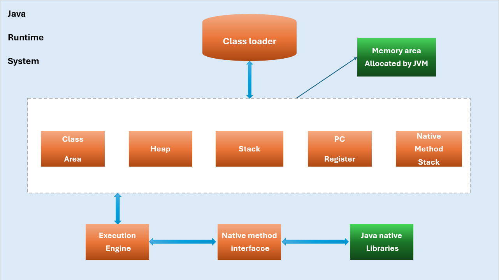

# Khái niệm JVM (Java Virtual Machine - Máy ảo Java)

## **Mục 1: Định nghĩa Cốt lõi**

**JVM (Java Virtual Machine)** là một "máy tính ảo" chạy bên trong máy tính thật của bạn. Nó là một chương trình phần mềm tạo ra một môi trường thực thi chuẩn hóa, nơi mà **Java bytecode** có thể được chạy. Vai trò của nó là cầu nối, dịch bytecode (ngôn ngữ phổ thông) thành mã máy (ngôn ngữ riêng) của hệ điều hành.

* **Ví von đời thực:** Hãy tưởng tượng JVM là một **phiên dịch viên cabin chuyên nghiệp** ngồi giữa bạn (mã bytecode) và một đối tác người Nhật (hệ điều hành). Bạn chỉ cần nói tiếng Việt (viết code Java một lần), người phiên dịch sẽ lắng nghe và dịch trực tiếp sang tiếng Nhật cho đối tác hiểu và thực hiện theo. Nếu bạn gặp đối tác người Pháp, người phiên dịch đó cũng sẽ dịch sang tiếng Pháp. Người phiên dịch (JVM) chính là bí quyết giúp bạn "nói một lần, mọi người đều hiểu".

### **Mục 2: Mục đích & Tầm quan trọng**

* **Mục đích**: Mục đích tối thượng của JVM là hiện thực hóa triết lý **"Viết một lần, chạy nhiều nơi"**. Nó che giấu đi sự phức tạp và khác biệt của phần cứng cũng như hệ điều hành bên dưới.
* **Tầm quan trọng**: JVM là **trái tim và linh hồn** của nền tảng Java. Không có nó, Java chỉ là một ngôn ngữ bình thường. JVM chịu trách nhiệm cho các tính năng đắt giá nhất của Java:
* **Tính độc lập nền tảng.**
* **Quản lý bộ nhớ tự động** (thông qua Garbage Collection).
* **Bảo mật** (chạy code trong một môi trường "hộp cát" an toàn).
* **Tối ưu hóa hiệu năng** một cách linh hoạt (thông qua JIT Compiler).

### **Mục 3: Cách hoạt động & Cơ chế bên trong**



Toàn bộ quá trình có thể được chia thành ba giai đoạn chính, tương ứng với các khối trong sơ đồ:

* **Nạp mã (Loading)**  
* **Lưu trữ & Quản lý bộ nhớ (Memory Management)**  
* **Thực thi (Execution)**  

#### **1. Giai đoạn Nạp mã: Class Loader (Trình nạp lớp)**

Đây là cổng vào của JVM. Khi bạn chạy lệnh `java MyProgram`, **Class Loader** sẽ là bộ phận đầu tiên hoạt động. Nhiệm vụ của nó là tìm, nạp và chuẩn bị các file bytecode (`.class`) từ ổ đĩa vào bộ nhớ của JVM.

Quá trình này bao gồm 3 bước nhỏ:

* **Loading (Nạp):** Đọc file `.class` và tạo một đối tượng `Class` tương ứng trong bộ nhớ Heap.
* **Linking (Liên kết):**
  * **Verification (Xác minh):** Kiểm tra xem bytecode có hợp lệ, an toàn và tuân thủ các quy tắc của Java hay không. Đây là một lớp bảo vệ quan trọng.
  * **Preparation (Chuẩn bị):** Cấp phát bộ nhớ cho các biến tĩnh (`static`) và gán giá trị mặc định cho chúng (ví dụ: `0` cho `int`, `null` cho đối tượng).
  * **Resolution (Phân giải):** Thay thế các tham chiếu tượng trưng trong code (ví dụ: tên lớp, tên phương thức) bằng các tham chiếu trực tiếp đến địa chỉ bộ nhớ thực.
* **Initialization (Khởi tạo):** Thực thi khối mã khởi tạo tĩnh (`static` block) và gán các giá trị ban đầu cho các biến tĩnh.

Sau khi Class Loader hoàn thành nhiệm vụ, toàn bộ thông tin về lớp của bạn đã sẵn sàng trong các vùng nhớ của JVM.

#### **2. Giai đoạn Lưu trữ: Runtime Data Areas (Các vùng nhớ lúc chạy)**

Đây là phần trung tâm của sơ đồ, là không gian làm việc của JVM. Bộ nhớ này được chia thành nhiều vùng, mỗi vùng có một mục đích riêng và được chia sẻ hoặc độc quyền cho từng luồng (thread).

* **Class Area (hay Method Area - Vùng phương thức):**
  * **Chức năng:** Lưu trữ thông tin ở cấp độ lớp, không phải đối tượng. Nó chứa "bản thiết kế" của các lớp, bao gồm: metadata của lớp, mã bytecode của các phương thức, và các biến tĩnh (`static variable`).
  * **Đặc điểm:** Chỉ có **một** vùng này và nó được **chia sẻ cho tất cả các luồng**.
  * *Ví von:* Đây là thư viện bản vẽ kỹ thuật của nhà máy.

* **Heap (Vùng nhớ đống):**
  * **Chức năng:** Đây là nơi tất cả các **đối tượng** (được tạo bằng từ khóa `new`) và các mảng được cấp phát bộ nhớ. Đây cũng là khu vực hoạt động chính của **Garbage Collector (GC)**.
  * **Đặc điểm:** Chỉ có **một** vùng Heap và nó được **chia sẻ cho tất cả các luồng**. Đây là vùng nhớ động lớn nhất.
  * *Ví von:* Đây là nhà kho và dây chuyền sản xuất của nhà máy, nơi các sản phẩm (đối tượng) được tạo ra và lưu trữ.

* **Stack (Vùng nhớ ngăn xếp):**
  * **Chức năng:** Lưu trữ thông tin về các lệnh gọi phương thức. Mỗi khi một phương thức được gọi, một "khung" (Stack Frame) mới sẽ được tạo và đẩy vào Stack. Khung này chứa các **biến cục bộ** (local variables), các tham chiếu đến đối tượng, và các kết quả tạm thời của phương thức đó. Khi phương thức kết thúc, khung của nó sẽ được gỡ ra.
  * **Đặc điểm:** **Mỗi luồng có một Stack riêng**, do đó không có xung đột dữ liệu trên Stack giữa các luồng.
  * *Ví von:* Đây là bàn làm việc cá nhân của mỗi công nhân (luồng), nơi họ để dụng cụ và các bộ phận đang lắp ráp cho công việc hiện tại.

* **PC Register (Program Counter Register - Thanh ghi bộ đếm chương trình):**
  * **Chức năng:** Lưu địa chỉ của chỉ thị bytecode **tiếp theo** mà luồng đang thực thi. Nó hoạt động như một con trỏ, cho biết "tôi đang làm đến đâu rồi".
  * **Đặc điểm:** **Mỗi luồng có một PC Register riêng**.
  * *Ví von:* Đây là ngón tay của bạn đang chỉ vào dòng chữ đang đọc trong một cuốn sách.

* **Native Method Stack (Ngăn xếp phương thức Native):**
  * **Chức năng:** Tương tự như Stack thông thường, nhưng nó được sử dụng riêng cho các phương thức "native" – là các phương thức được viết bằng ngôn ngữ khác như C/C++.
  * **Đặc điểm:** **Mỗi luồng có một Native Method Stack riêng**.
  * *Ví von:* Đây là một bàn làm việc chuyên dụng khác, dùng cho các công việc cần công cụ đặc biệt không có trong bộ đồ nghề Java chuẩn.

#### **3. Giai đoạn Thực thi & Tương tác**

Sau khi đã có "nhà kho" (Heap) và "bàn làm việc" (Stack), đã đến lúc thực hiện công việc.

* **Execution Engine (Bộ máy thực thi):**
  * **Chức năng:** Đây là bộ phận "CPU ảo" của JVM. Nó đọc bytecode từ Class Area và thực thi chúng. Nó bao gồm:
    * **Interpreter (Trình thông dịch):** Đọc và thực thi từng lệnh bytecode một cách tuần tự.
    * **JIT Compiler (Trình biên dịch tức thời):** Để tối ưu hiệu năng, JIT sẽ tìm các đoạn code được chạy thường xuyên ("hot code") và dịch chúng thành mã máy gốc (native code) để chạy nhanh hơn nhiều.
    * **Garbage Collector (Bộ thu gom rác):** Hoạt động ngầm để dọn dẹp các đối tượng không còn được sử dụng trong Heap.

* **Java Native Interface (JNI - Giao diện Native của Java):**
  * **Chức năng:** Đây là một cái "cầu nối". Nó là một framework cho phép mã Java đang chạy trong JVM có thể gọi hoặc được gọi bởi các ứng dụng và thư viện viết bằng ngôn ngữ khác như C, C++.
  * *Ví von:* Đây là bộ chuyển đổi giắc cắm, cho phép bạn cắm thiết bị Java vào "ổ điện" của thế giới C/C++.

* **Java Native Libraries (Các thư viện Native của Java):**
  * **Chức năng:** Đây là các thư viện được viết bằng C/C++ (hoặc ngôn ngữ khác) cung cấp các chức năng cấp thấp mà bản thân Java không trực tiếp xử lý (ví dụ: các thao tác I/O, đồ họa cấp thấp). JNI chính là cầu nối để Execution Engine có thể sử dụng các thư viện này.

### **Tổng kết luồng hoạt động**

1. Bạn chạy lệnh `java MyProgram`.
2. **Class Loader** nạp file `MyProgram.class` vào JVM.
3. Thông tin lớp được lưu vào **Class Area**, biến tĩnh được chuẩn bị.
4. **Execution Engine** bắt đầu thực thi phương thức `main()`.
5. Một khung (frame) cho `main()` được đẩy vào **Stack** của luồng chính. **PC Register** trỏ đến lệnh đầu tiên.
6. Khi code tạo đối tượng `new MyObject()`, bộ nhớ cho đối tượng này được cấp phát trên **Heap**, và một tham chiếu đến nó được lưu trong biến cục bộ trên **Stack**.
7. Nếu code gọi một phương thức `native`, **JNI** sẽ được sử dụng để thực thi mã trong **Java Native Libraries**, và **Native Method Stack** sẽ được dùng.
8. Trong suốt quá trình, **Garbage Collector** âm thầm chạy trên **Heap** để dọn dẹp. **JIT Compiler** cũng theo dõi và tối ưu các đoạn code "nóng".
9. Khi phương thức `main()` kết thúc, luồng chính kết thúc và JVM tắt.

### **Mục 4: Cú pháp & Ví dụ Code thực tế**

Bạn không trực tiếp viết code "cho" JVM, nhưng bạn tương tác với nó qua dòng lệnh và cách bạn viết code Java.

**Ví dụ 1: Tương tác cơ bản**

```bash
# Lệnh này yêu cầu hệ điều hành khởi động chương trình "java.exe" (chính là JVM).
# JVM sẽ nạp file HelloWorld.class, tìm phương thức main và bắt đầu thực thi từ đó.
java HelloWorld
```

**Ví dụ 2: Tinh chỉnh bộ nhớ cho JVM**

Trong các ứng dụng thực tế, chúng ta thường phải ra lệnh cho JVM về dung lượng bộ nhớ được phép sử dụng.

```java
// File: MemoryWaster.java
import java.util.ArrayList;
import java.util.List;

public class MemoryWaster {
public static void main(String[] args) {
// Chương trình này liên tục tạo đối tượng lớn để làm đầy bộ nhớ Heap.
List<Object> list = new ArrayList<>();
while (true) {
// Mỗi lần lặp, thêm vào 1 đối tượng 10MB
list.add(new byte[10 * 1024 * 1024]); 
System.out.println("Đã cấp phát thêm 10MB...");
}
}
}
```

Bây giờ, hãy chạy chương trình này với các tham số để điều khiển JVM:

```bash
# Chạy chương trình và ra lệnh cho JVM rằng:
# -Xms256m: Bộ nhớ Heap ban đầu là 256MB.
# -Xmx512m: Bộ nhớ Heap tối đa là 512MB.
# Khi bộ nhớ Heap vượt quá 512MB, chương trình sẽ sập với lỗi OutOfMemoryError.
# Điều này cho thấy ta có thể ra lệnh và kiểm soát các vùng nhớ của JVM.
java -Xms256m -Xmx512m MemoryWaster
```

### **Mục 5: So sánh & Đối chiếu**

**JVM vs. Máy thật**

| Tiêu chí             | Máy tính thật                           | Máy ảo Java (JVM)                                                     |
| :-------------------- | :-------------------------------------- | :-------------------------------------------------------------------- |
| **Ngôn ngữ thực thi** | Mã máy (phụ thuộc CPU: x86, ARM)        | Java bytecode (độc lập kiến trúc)                                     |
| **Nền tảng** | Là nền tảng vật lý (phần cứng + HĐH)    | Là một chương trình chạy trên nền tảng thật                          |
| **Mục đích** | Chạy mọi loại phần mềm tương thích     | Tạo ra một môi trường trừu tượng, chuẩn hóa chỉ để chạy bytecode       |

**JVM (Java) vs. CLR (.NET)**

**CLR (Common Language Runtime)** là câu trả lời của Microsoft cho JVM. Cả hai đều là những máy ảo cực kỳ thành công.

| Tiêu chí        | JVM                              | CLR                                     |
| :-------------- | :------------------------------- | :-------------------------------------- |
| **Hệ sinh thái** | Java (Java, Kotlin, Scala,...)    | .NET (C\#, F\#, VB.NET)                   |
| **Mã trung gian** | Java Bytecode                    | CIL (Common Intermediate Language)      |
| **Nền tảng** | Đa nền tảng từ đầu               | Ban đầu chỉ cho Windows, nay đã đa nền tảng (.NET Core/5+) |

### **Mục 6: Lưu ý, "Best Practices" & Các lỗi thường gặp**

* **Lưu ý:** JVM là một đặc tả, và có nhiều "hiện thực" (implementation) khác nhau: **HotSpot** của Oracle (phổ biến nhất), **OpenJ9** của Eclipse (nổi tiếng về khởi động nhanh và ít tốn bộ nhớ), **GraalVM** (hiệu năng cao).
* **Best Practices:**
* **Hãy tin tưởng JVM**. Trình biên dịch JIT của nó cực kỳ thông minh. Đừng cố tối ưu hóa code quá sớm.
* **Hiểu rõ mô hình bộ nhớ của JVM (Heap vs. Stack)**. Đây là kiến thức nền tảng để viết code hiệu quả và không bị rò rỉ bộ nhớ.
* Với các ứng dụng quan trọng, hãy **giám sát sức khỏe của JVM** bằng các công cụ như JConsole, VisualVM (có sẵn trong JDK) hoặc các công cụ thương mại.
* Học các cờ (flag) tinh chỉnh JVM cơ bản như `-Xms` (kích thước Heap ban đầu) và `-Xmx` (kích thước Heap tối đa).
* **Các lỗi thường gặp:**

1. **`OutOfMemoryError`**: Xảy ra khi Heap đã đầy và Garbage Collector không thể dọn dẹp thêm không gian để tạo đối tượng mới. Cách khắc phục: tăng dung lượng Heap (`-Xmx`) hoặc sửa lỗi rò rỉ bộ nhớ (memory leak) trong code.
2. **`StackOverflowError`**: Xảy ra khi một phương thức gọi đệ quy chính nó mà không có điểm dừng, làm cho Stack bị tràn. Cách khắc phục: sửa lại logic đệ quy.
